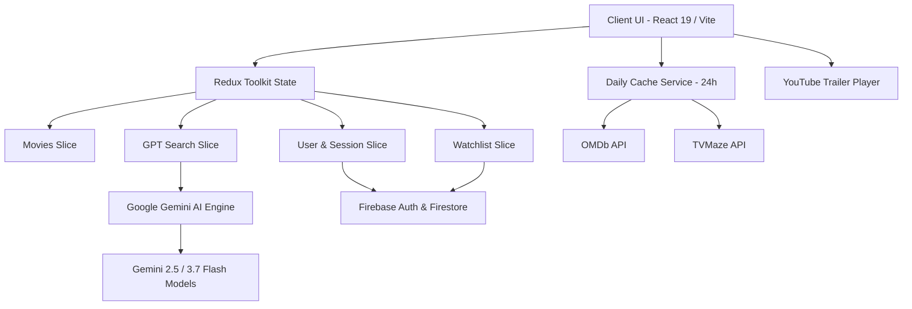

# 🍿 Netflix GPT — AI-Powered Next-Gen Streaming Experience

[](https://vidhya112.github.io/Netflix_App/)
[](https://react.dev/)
[](https://vitejs.dev/)
[](https://ai.google.dev/)
[](https://firebase.google.com/)
[](https://tailwindcss.com/)

A modern, full-stack **Netflix Clone** integrated with **Google Gemini AI (`gemini-flash-latest` / `gemini-3.7-flash`)**, **OMDb API**, and **TVMaze API**. Features conversational AI film curation, live daily catalog caching, instant video trailer streaming, real-time Cloud Firestore synchronization, multi-device session management, and multi-language support.

---

## 🌐 Live Deployment

- 🚀 **GitHub Pages**: [https://vidhya112.github.io/Netflix_App/](https://vidhya112.github.io/Netflix_App/)
- 🔥 **Firebase Hosting Ready**: Configured for seamless deployment via Firebase CLI and GitHub Actions.

---

## 🌟 Implemented & Unique Functionalities

### 🤖 1. Multi-Model Google Gemini AI Recommendation Engine
- **Cascading AI Fallback Architecture**: Dynamically queries a priority cascade of Gemini models (`gemini-flash-lite-latest` → `gemini-3.5-flash-lite` → `gemini-3.5-flash` → `gemini-3.7-flash` → `gemini-flash-latest`) to eliminate rate-limit or downtime bottlenecks.
- **Natural Language Discovery**: Converts complex conversational requests (e.g. *"mind-bending psychological thrillers with shocking twists"*) into structured JSON recommendations.
- **AI Rationale & Micro-Reviews**: Generates tailored 1–2 sentence explanations for why each movie matches the user's vibe.
- **Smart Offline/Curated Fallback**: Seamless offline support with genre-matched curated datasets if API keys are missing or offline.
- **Quick-Prompt Suggestions**: One-click prompt chips for rapid exploration.

### ⚡ 2. 24-Hour Zero-Latency Daily Catalog Engine
- **Smart Browser Cache**: Caches category shelves (`Now Playing`, `Popular`, `Top Rated`, `Upcoming`, `Trending`) in browser `localStorage` with a 24-hour expiration cycle.
- **Sub-Millisecond Return Loads**: Instant 0ms page rendering on revisit without redundant API consumption.
- **Dual API Aggregation**: Real-time integration with **OMDb API** (synopses, IMDb ratings, awards, high-resolution posters) and **TVMaze API** (popular episodic series).

### 🎬 3. Rich Movie Details & Multi-Tier Visual Cascade
- **Cinematic Detail Modal**: Full-screen modal featuring HD backdrops, runtime, release year, IMDb match score, genres, and cast information.
- **Multi-Tier Visual Fallback**: Automatic image resolution cascade:
  1. *16:9 Landscape Backdrops*
  2. *Official HD YouTube Trailer Thumbnails (`maxresdefault` / `hqdefault`)*
  3. *High-Resolution Vertical Posters*
- **"Where to Watch" Streaming Availability**: Detects and displays available streaming platforms (Netflix, Prime Video, Apple TV+, Disney+, etc.) with branded provider badges.
- **Cast & Crew Directory**: Displays top cast members with profile photos, character roles, and visual avatars.

### 🎥 4. Embedded YouTube Trailer Streaming
- **Cinematic 16:9 Player**: Instant pop-up video player with auto-resolving YouTube trailers.
- **Widescreen Mode & Overlay Controls**: Fully responsive with ambient backdrop blur, full keyboard accessibility (`Esc` to close), and seamless video playback.

### 🔐 5. Firebase Authentication & Cloud Firestore Sync
- **Client Session Authentication**: Resilient sign-up, sign-in, and guest session handling.
- **Password Recovery Workflows**: Integrated Forgot Password and Password Reset modals.
- **Real-Time Watchlist**: Cloud Firestore `onSnapshot` real-time listener syncing "My List" across tabs and devices with immediate toast feedback.
- **Security & Multi-Device Session Manager**:
  - Automatically identifies client device name, OS, browser, and session activity.
  - View all active devices logged into your account in real-time.
  - Remote session termination (revoke individual sessions or sign out of all other devices with one click).

### 👤 6. Netflix Profiles & Avatar Switcher
- **Iconic Avatar Selector**: Switch between iconic Netflix profile avatars in real time.
- **Redux State Persistence**: Instant profile synchronization across navigation and modals.

### 🌐 7. Multi-Language Internationalization (i18n)
- **6 Supported Languages**: English 🇬🇧, Hindi 🇮🇳, Spanish 🇪🇸, French 🇫🇷, German 🇩🇪, Japanese 🇯🇵.
- **Full UI Translation**: Header navigation, search inputs, movie categories, toast alerts, and modal labels adapt dynamically.

### 📱 8. Ultra-Modern Responsive UI/UX
- **Ambient Glassmorphism**: Translucent navbars, frosted modal backdrops, and glowing red accent highlights.
- **Shimmering Skeleton Loaders**: Fluid loading animations during AI searches and data fetching.
- **Adaptive Navigation**: Desktop top bar navigation + mobile/tablet bottom navigation bar with active tab indicators and badge counters.

---

## 🛠️ Architecture & Tech Stack



| Layer | Technology | Purpose |
|---|---|---|
| **Core Framework** | React 19, TypeScript, Vite 6 | Lightning-fast component rendering & type safety |
| **State Management** | Redux Toolkit (`@reduxjs/toolkit`), React-Redux | Centralized store for movies, AI search, auth, and watchlist |
| **Styling & Icons** | Tailwind CSS, Lucide Icons | Responsive utility-first design & modern iconography |
| **Generative AI** | Google Gemini API (`gemini-flash-latest` / `gemini-3.7-flash`) | Natural language recommendations & structured metadata |
| **Movie Metadata** | OMDb API (`plot=full`), TVMaze API | Verified plot summaries, ratings, cast, and poster art |
| **Backend & Cloud** | Firebase Auth, Cloud Firestore | User authentication, multi-device sessions & real-time watchlist sync |
| **Media Streaming** | YouTube IFrame API | Embedded trailer video streaming |
| **CI/CD & Hosting** | GitHub Actions, GitHub Pages, Firebase Hosting | Automated builds, secret management & production deployments |

---

## 📂 Project Structure

```
Netflix_App/
├── .github/workflows/
│   └── deploy.yml              # Automated CI/CD pipeline for GitHub Pages & Firebase
├── public/                     # Static assets & icons
├── src/
│   ├── api/                    # API configurations
│   ├── components/
│   │   ├── common/             # Reusable UI (MovieCard, SkeletonCard, Toast, VideoModal, ProviderIcon)
│   │   ├── gptSearchPage/      # AI Search Bar, Suggestion Grids, Prompt Chips
│   │   ├── homePage/           # Hero Banner, Category Rows, Video Trailers
│   │   ├── layout/             # Header, Footer, Browse, Login, Body
│   │   ├── modal/              # MovieDetailsModal, SessionManagerModal, ForgotPasswordModal
│   │   └── watchlist/          # Dedicated Watchlist grid view
│   ├── features/               # Redux Slices (movieSlice, gptSlice, userSlice, watchlistSlice, configSlice)
│   ├── hooks/                  # Custom hooks for movie feeds & trailer fetching
│   ├── services/
│   │   ├── dailyCacheService.ts# 24-hour browser caching engine
│   │   ├── firestoreService.ts # Real-time Firestore sync & session manager
│   │   ├── geminiService.ts    # Multi-model Gemini AI integration & fallback
│   │   ├── movieService.ts     # Movie detail aggregation & provider lookups
│   │   ├── omdbService.ts      # OMDb API client
│   │   └── tvmazeService.ts    # TVMaze API client
│   ├── store/                  # Redux store configuration
│   ├── types/                  # TypeScript interface definitions
│   └── utils/                  # Constants, Firebase config, language dictionaries, validators
├── .env.example                # Environment variable reference
├── package.json
├── tailwind.config.js
└── vite.config.ts
```

---

## 🚀 Getting Started

### 1. Prerequisites
- **Node.js** (v18 or higher, v22 recommended)
- **npm** (v9 or higher)

### 2. Clone the Repository
```bash
git clone https://github.com/vidhya112/Netflix_App.git
cd Netflix_App
```

### 3. Install Dependencies
```bash
npm install
```

### 4. Configure Environment Variables
Create a `.env` file in the project root:
```env
# Google Gemini AI API Key (Get from https://aistudio.google.com/app/apikey)
VITE_GEMINI_API_KEY=your_gemini_api_key_here

# OMDb API Key (Free 1000 req/day from https://www.omdbapi.com/apikey.aspx)
VITE_OMDB_API_KEY=your_omdb_api_key_here

# Firebase Configuration (Optional - Defaults provided in codebase for quick start)
VITE_FIREBASE_API_KEY=your_firebase_api_key
VITE_FIREBASE_AUTH_DOMAIN=your_project.firebaseapp.com
VITE_FIREBASE_PROJECT_ID=your_project_id
VITE_FIREBASE_STORAGE_BUCKET=your_project.firebasestorage.app
VITE_FIREBASE_MESSAGING_SENDER_ID=your_sender_id
VITE_FIREBASE_APP_ID=your_app_id
VITE_FIREBASE_MEASUREMENT_ID=your_measurement_id
```

### 5. Run the Development Server
```bash
npm run dev
```
Open [http://localhost:3000](http://localhost:3000) (or the port specified in terminal) in your browser.

### 6. Build for Production
```bash
npm run build
```

---

## 📦 Deployment & CI/CD

### Automated GitHub Pages Deployment
A GitHub Actions workflow is included in [`.github/workflows/deploy.yml`](.github/workflows/deploy.yml).

Every push to the `main` branch triggers an automated build and deploy:
1. Configure your repository secrets in **GitHub > Settings > Secrets and variables > Actions**:
   - `VITE_GEMINI_API_KEY`
   - `VITE_OMDB_API_KEY`
   - `FIREBASE_TOKEN` *(Optional: for Firebase Hosting)*
2. In GitHub repository settings, go to **Pages** and set **Source** to **GitHub Actions**.

### Deploy to Firebase Hosting
```bash
# Login to Firebase
npx firebase-tools login

# Deploy hosting target
npm run build
npx firebase-tools deploy --only hosting
```

---

## 📄 License
This project is open source and available under the [MIT License](LICENSE).